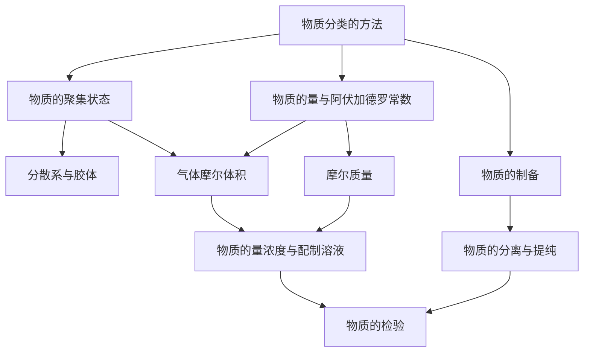

# 第一章 · 化学研究的天地

> 本章了解物质的分类方法，学习如何用"物质的量"计量物质，以及化学研究中常用的实验方法（制备、分离提纯、检验、配制溶液）。

## §1.1 物质的分类

- [[物质分类的方法]] — 纯净物与混合物、单质与化合物、酸碱盐氧化物等分类体系
- [[物质的聚集状态]] — 气液固三态的宏观与微观特征、三态变化
- [[分散系与胶体]] — 分散系分类、胶体的丁达尔现象、电泳与聚沉

## §1.2 物质的量

- [[物质的量与阿伏加德罗常数]] — 物质的量（n）、摩尔（mol）、阿伏加德罗常数（$N_A$）、$n = N/N_A$
- [[摩尔质量]] — 摩尔质量（M）定义、与相对原子/分子质量的关系、$n = m/M$
- [[气体摩尔体积]] — 气体摩尔体积（$V_m$）、标准状况下 22.4 L/mol、阿伏加德罗定律

## §1.3 化学中常用的实验方法

- [[物质的制备]] — 制备原则、实验安全、实验室制备氯气
- [[物质的分离与提纯]] — 结晶、蒸馏、萃取和分液
- [[物质的检验]] — 焰色反应、显色法、沉淀法、气体法
- [[物质的量浓度与配制溶液]] — 物质的量浓度（$c_B = n_B/V$）、容量瓶使用、溶液稀释

---

## 章节状态

| 节 | 知识点数 | 平均掌握度 | 状态 |
|---|---|---|---|
| §1.1 | 3 | 0 | 📥 已录入 |
| §1.2 | 3 | 0 | 📥 已录入 |
| §1.3 | 4 | 0 | 📥 已录入 |

**综合测试：** 未进行

---

## 知识结构图

