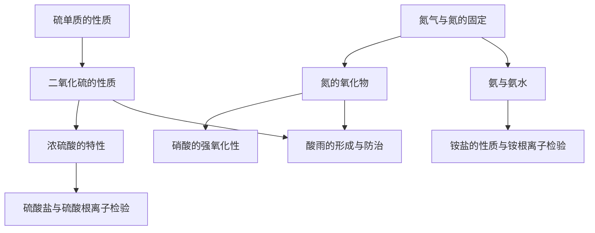

# 第三章 · 硫、氮及其循环

> 本章以硫、氮两种非金属元素为主线，学习其单质和重要化合物的性质与转化，建立"价态—性质—转化"的分析框架，并理解自然界中硫循环和氮循环的生态意义。

## §3.1 硫及其重要化合物

- [[硫单质的性质]] — 物理/化学性质、与金属/非金属反应
- [[二氧化硫的性质]] — 酸性氧化物、漂白性、还原性与氧化性
- [[浓硫酸的特性]] — 吸水性、脱水性、强氧化性、钝化
- [[硫酸盐与硫酸根离子检验]] — 常见硫酸盐、BaCl₂检验法

## §3.2 氮及其重要化合物

- [[氮气与氮的固定]] — 氮气性质、自然固氮与人工固氮
- [[氮的氧化物]] — NO和NO₂的性质、转化关系
- [[氨与氨水]] — 氨的物化性质、喷泉实验、一水合氨
- [[铵盐的性质与铵根离子检验]] — 受热分解、与碱反应、检验方法
- [[硝酸的强氧化性]] — 浓/稀硝酸与金属反应、不生成H₂

## §3.3 硫循环和氮循环

- [[酸雨的形成与防治]] — 成因、危害、防治措施

---

## 章节状态

| 节 | 知识点数 | 平均掌握度 | 状态 |
|---|---|---|---|
| §3.1 | 4 | 0 | 📥 已录入 |
| §3.2 | 5 | 0 | 📥 已录入 |
| §3.3 | 1 | 0 | 📥 已录入 |

**综合测试：** 未进行

---

## 知识结构图

