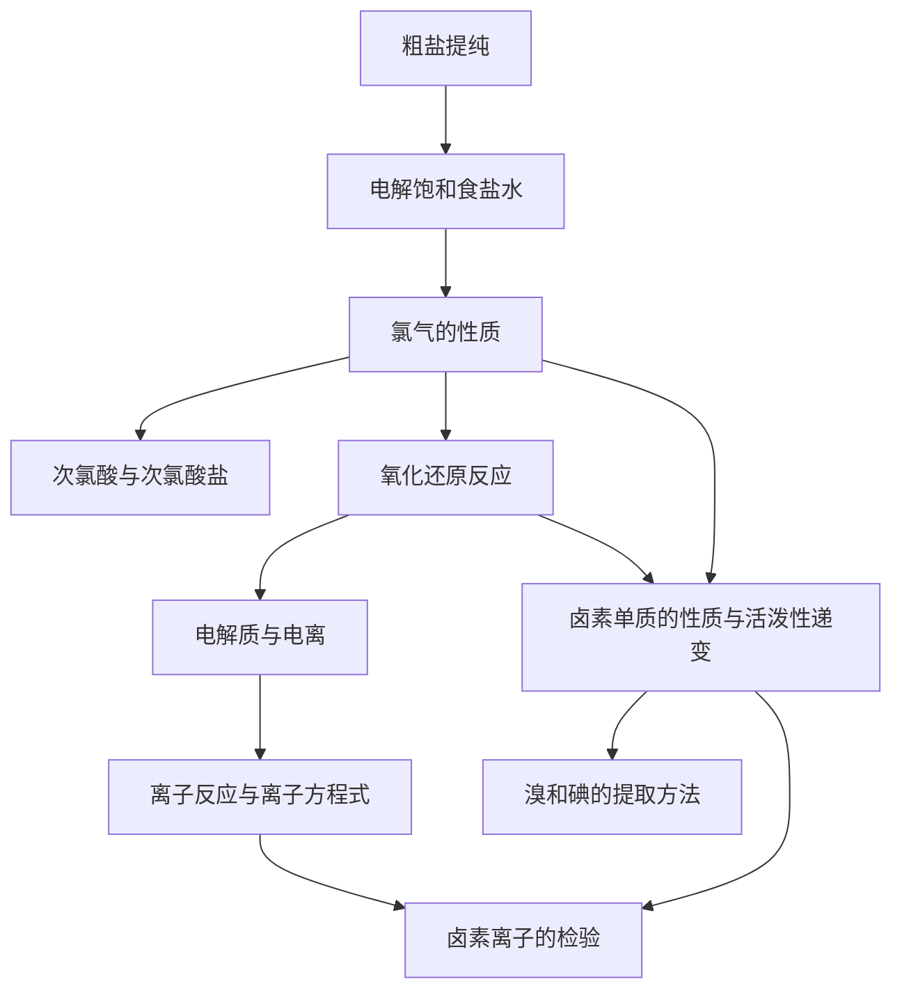

# 第二章 · 海洋中的卤素资源

> 本章以海水中氯化钠为起点，学习氯气及含氯化合物的性质，建立氧化还原反应和离子反应两大理论视角，并拓展到溴、碘的提取及卤素性质递变规律。

## §2.1 海水中的氯

- [[粗盐提纯]] — 化学沉淀法除去 $Ca^{2+}$、$Mg^{2+}$、$SO_4^{2-}$
- [[电解饱和食盐水]] — 氯碱工业原理、产物及应用
- [[氯气的性质]] — 物理性质、与金属/非金属/水/碱的反应
- [[次氯酸与次氯酸盐]] — 漂白原理、漂白粉、消毒应用

## §2.2 氧化还原反应和离子反应

- [[氧化还原反应]] — 化合价升降、电子转移本质、氧化剂与还原剂
- [[电解质与电离]] — 强/弱电解质、电离方程式
- [[离子反应与离子方程式]] — 离子反应发生条件、书写四步法

## §2.3 溴和碘的提取

- [[卤素单质的性质与活泼性递变]] — Cl₂>Br₂>I₂ 的规律、物理性质递变
- [[溴和碘的提取方法]] — 从海水/海带中提取的工艺流程
- [[卤素离子的检验]] — AgNO₃法鉴别 Cl⁻、Br⁻、I⁻

---

## 章节状态

| 节 | 知识点数 | 平均掌握度 | 状态 |
|---|---|---|---|
| §2.1 | 4 | 0 | 📥 已录入 |
| §2.2 | 3 | 0 | 📥 已录入 |
| §2.3 | 3 | 0 | 📥 已录入 |

**综合测试：** 未进行

---

## 知识结构图

