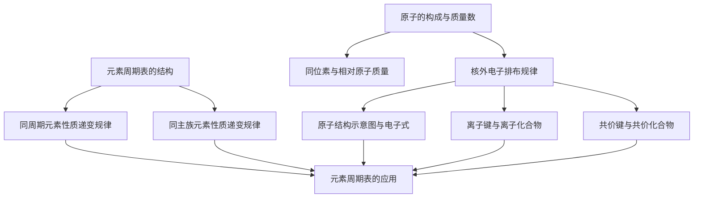

# 第四章 · 原子结构和化学键

> 本章从元素周期表出发，揭示元素性质的周期性递变规律，深入原子内部探索核外电子排布规律，最终理解原子间如何通过离子键和共价键结合成物质。核心线索："位置—结构—性质"三位一体。

## §4.1 元素周期表和元素周期律

- [[元素周期表的结构]] — 周期、族、主族与副族的划分
- [[同周期元素性质递变规律]] — Na→Cl金属性减弱、非金属性增强
- [[同主族元素性质递变规律]] — 碱金属、卤族的递变
- [[元素周期表的应用]] — 位置-结构-性质关系、预测未知元素

## §4.2 原子结构

- [[原子的构成与质量数]] — 质子/中子/电子、质量数公式
- [[同位素与相对原子质量]] — 核素、同位素、丰度加权计算

## §4.3 核外电子排布

- [[核外电子排布规律]] — 电子层、2n²规则、排布三原则
- [[原子结构示意图与电子式]] — 表示方法、稳定结构判断

## §4.4 化学键

- [[离子键与离子化合物]] — 电子得失成键、NaCl形成过程
- [[共价键与共价化合物]] — 共用电子对、结构式、分子空间结构

---

## 章节状态

| 节 | 知识点数 | 平均掌握度 | 状态 |
|---|---|---|---|
| §4.1 | 4 | 0.3 | 🔄 学习中 |
| §4.2 | 2 | 0.3 | 🔄 学习中 |
| §4.3 | 2 | 0.3 | 🔄 学习中 |
| §4.4 | 2 | 0.3 | 🔄 学习中 |

**综合测试：** 未进行

---

## 知识结构图

