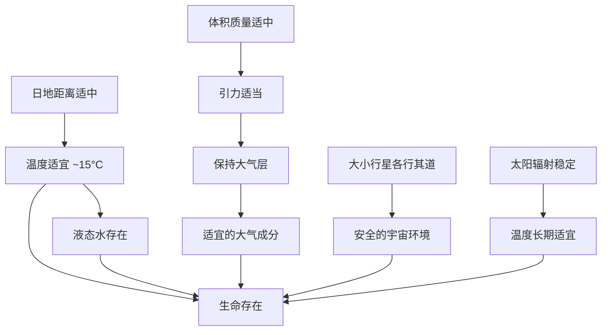

# 地球存在生命的条件

## 核心框架

地球存在生命的条件分为**外部条件**（宇宙环境）和**自身条件**两大类。

## 一、外部条件

| 条件 | 具体内容 | 为什么重要 |
|---|---|---|
| **安全的宇宙环境** | 太阳系中大小行星各行其道，互不干扰 | 地球不会被其他天体撞击而毁灭 |
| **稳定的太阳辐射** | 太阳从诞生至今光照条件没有明显变化 | 地球表面温度长期保持适宜，生命得以持续演化 |

## 二、自身条件

| 条件 | 原因 | 结果 |
|---|---|---|
| **适宜的温度** | 日地距离适中（约 1.5 亿千米） | 地球表面平均温度约 15°C，适合生命活动 |
| **适宜的大气层** | 地球的体积和质量适中 → 引力适当 | 能吸引并保持适合生物呼吸的大气层（N₂ 和 O₂ 为主） |
| **液态水的存在** | 温度条件 + 原始地球水汽凝结 | 液态水是生命活动的基本介质 |

## 三、逻辑链条图

## 四、拓展思考

如何判断某颗行星是否可能存在生命？关键看：
1. 是否位于恒星的"宜居带"（距恒星不太远也不太近）
2. 是否有足够的质量维持大气层
3. 是否有液态水的证据
4. 宇宙环境是否安全稳定

---

## 易错点

1. **"日地距离适中"不直接等于"有液态水"**——日地距离适中→温度适宜→水可以液态形式存在，这是因果链
2. **外部条件容易遗漏**：很多同学只答自身条件，忘了"安全的宇宙环境"和"稳定的太阳辐射"
3. **"体积质量适中"的因果链**：体积质量适中 → 引力适当 → 能保持大气 → 有适宜的大气成分。不要跳步！

---

## 关联知识点

- [[天体与天体系统]]
- [[太阳系与地球]]
- [[太阳辐射及其对地球的影响]]
