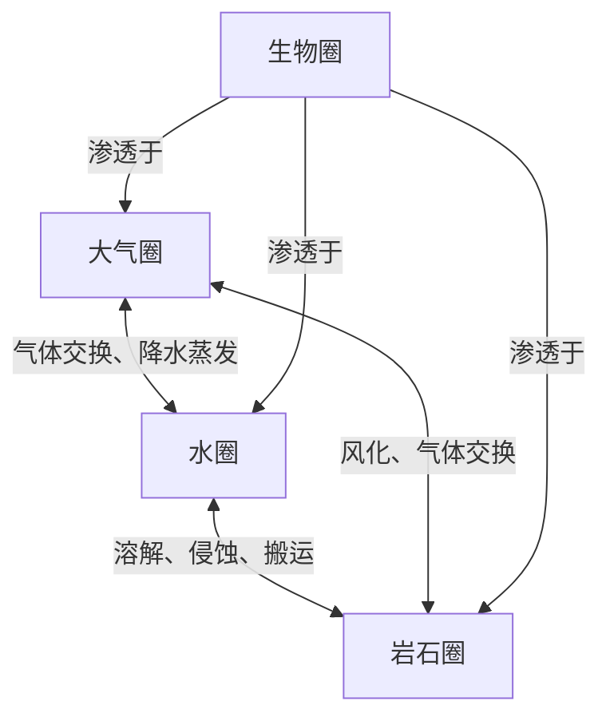

# 地球的外部圈层

## 一、外部圈层概述

地球的外部圈层包括**大气圈**、**水圈**和**生物圈**。它们与岩石圈相互联系、相互渗透，共同构成人类赖以生存和发展的自然环境。

## 二、三大外部圈层

### 大气圈

| 要素 | 内容 |
|---|---|
| 组成 | 气体和悬浮物质（主要成分：N₂ 和 O₂） |
| 作用 | 使地球上的温度变化和缓；提供生物呼吸所需O₂；产生风、云、雨、雪等天气现象 |
| 范围 | 从地表向上延伸数千千米，无明确上界 |

### 水圈

| 要素 | 内容 |
|---|---|
| 组成 | 地表和近地表的各种形态水体（海洋、河流、湖泊、沼泽、冰川、地下水） |
| 主体 | **海洋**（占全球水量约96.53%） |
| 作用 | 物质迁移和能量转换的重要介质；人类和其他生物生存发展不可或缺 |
| 特点 | 水是最活跃的自然环境要素之一；水圈是连续但不规则的 |

### 生物圈

| 要素 | 内容 |
|---|---|
| 定义 | 地球表层生物的总称 |
| 范围 | 涉及大气圈底部、水圈全部、岩石圈表面；大多数生物集中在大气圈、水圈与岩石圈很薄的接触带中 |
| 作用 | 促进太阳能转化、改变大气圈和水圈组成、改造地表形态 |

## 三、各圈层的相互关系

- 四大圈层（大气圈、水圈、生物圈、岩石圈）**相互联系、相互渗透**
- 自然环境是这些圈层相互作用的产物
- 生物圈是最特殊的——它不像其他圈层有独立的空间范围，而是**渗透于其他三个圈层之中**

## 四、内部圈层与外部圈层的对比

| | 内部圈层 | 外部圈层 |
|---|---|---|
| 组成 | 地壳、地幔、地核 | 大气圈、水圈、生物圈 |
| 研究方法 | 地震波间接推断 | 直接观察 |
| 分界 | 莫霍界面、古登堡界面 | 无明确界面，相互渗透 |
| 连接处 | **岩石圈**（地壳+上地幔顶部） | 岩石圈表面 |

---

## 易错点

1. **生物圈没有独立的空间范围**——它渗透于其他三个圈层中，不是一个"壳"
2. **水圈的主体是海洋**——不是河流或冰川
3. **岩石圈是内外部圈层的"桥梁"**——它既属于内部圈层体系（地壳+上地幔顶部），又是外部圈层的承载基础

---

## 关联知识点

- [[地震波与地球内部圈层]]
- [[大气的组成]]
- [[水循环的过程和类型]]
