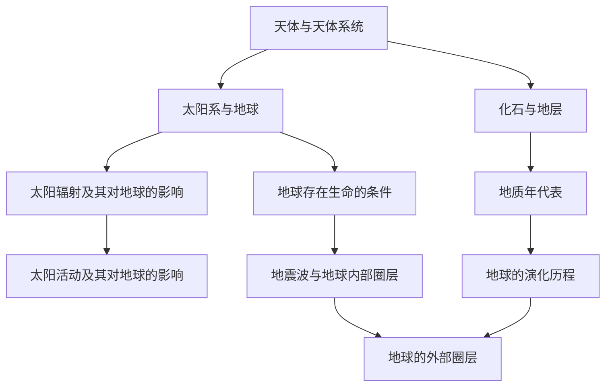

# 第一章 · 宇宙中的地球

> 本章认识地球所处的宇宙环境，了解太阳对地球的影响，掌握地球的演化历史和圈层结构。

## §1.1 地球的宇宙环境

- [[天体与天体系统]] - 恒星、行星、卫星、星云等天体类型；天体系统的层次（总星系→银河系→太阳系→地月系）
- [[太阳系与地球]] - 八大行星分类（类地/巨/远日）、运动特征（共面性、近圆性、同向性）；地球的普通性与特殊性
- [[地球存在生命的条件]] - 外部条件（安全的宇宙环境、稳定的太阳辐射）与自身条件（日地距离适中→温度适宜、体积质量适中→大气层、液态水）

## §1.2 太阳对地球的影响

- [[太阳辐射及其对地球的影响]] - 太阳辐射的能量来源（核聚变）、太阳常数、太阳辐射对地球的影响（能量来源、气候、生物）
- [[太阳活动及其对地球的影响]] - 太阳大气分层（光球→色球→日冕）、太阳活动类型（黑子、耀斑、日珥、太阳风）、活动周期（约11年）、对地球影响（电离层→通信、磁场→磁暴、气候相关）

## §1.3 地球的历史

- [[化石与地层]] - 地层的概念与特征、化石的形成与意义、地层层序律
- [[地质年代表]] - 宙→代→纪的划分、主要地质年代（冥古宙、太古宙、元古宙、显生宙）
- [[地球的演化历程]] - 各地质时代的海陆格局、气候特征、生物演化（从低等到高等、从水生到陆生）

## §1.4 地球的圈层结构

- [[地震波与地球内部圈层]] - 纵波(P波)与横波(S波)的特征、莫霍界面与古登堡界面、地壳/地幔/地核的划分与特征
- [[地球的外部圈层]] - 大气圈、水圈、生物圈的组成与特征、各圈层间的相互联系

---

## 章节状态

| 节 | 知识点数 | 平均掌握度 | 状态 |
|---|---|---|---|
| §1.1 | 3 | 0 | 已录入 |
| §1.2 | 2 | 0 | 已录入 |
| §1.3 | 3 | 0 | 已录入 |
| §1.4 | 2 | 0 | 已录入 |

**综合测试:** 未进行

---

## 知识结构图

