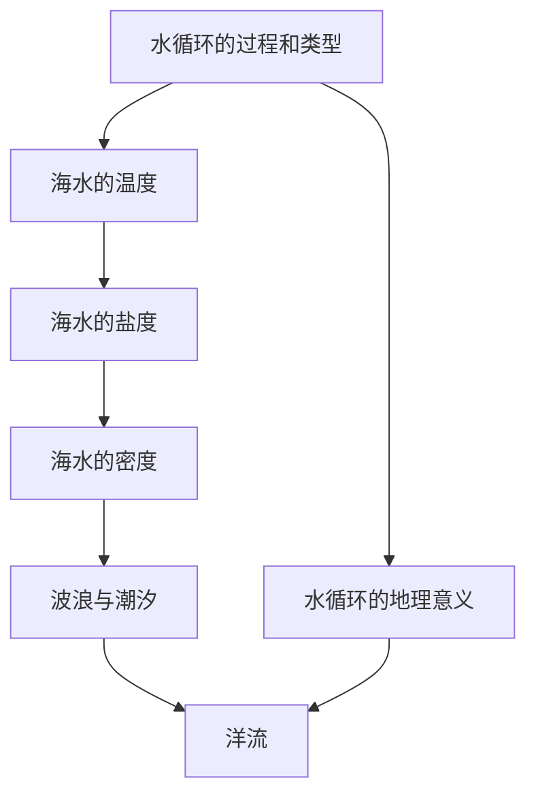

# 第三章 · 地球上的水

> 本章认识水循环的过程和意义，了解海水的温度、盐度等性质，掌握洋流等海水运动形式。

## §3.1 水循环

- [[水循环的过程和类型]] - 海陆间循环、陆地内循环、海上内循环的环节（蒸发、输送、降水、径流、下渗）
- [[水循环的地理意义]] - 维持水量平衡、更新水资源、塑造地表形态、联系各圈层

## §3.2 海水的性质

- [[海水的温度]] - 海水温度的分布规律（表层水温随纬度变化、垂直方向变化）、影响因素
- [[海水的盐度]] - 盐度概念、分布规律（副热带最高）、影响因素（蒸发、降水、径流、洋流）
- [[海水的密度]] - 密度分布规律与影响因素

## §3.3 海水的运动

- [[波浪与潮汐]] - 波浪的成因与类型、潮汐的成因（引潮力）与规律
- [[洋流]] - 洋流的成因分类（风海流、密度流、补偿流）、世界洋流分布规律、洋流对地理环境的影响（气候、渔场、航行、污染）

---

## 章节状态

| 节 | 知识点数 | 平均掌握度 | 状态 |
|---|---|---|---|
| §3.1 | 2 | 0 | 已录入 |
| §3.2 | 3 | 0 | 已录入 |
| §3.3 | 2 | 0 | 已录入 |

**综合测试:** 未进行

---

## 知识结构图

