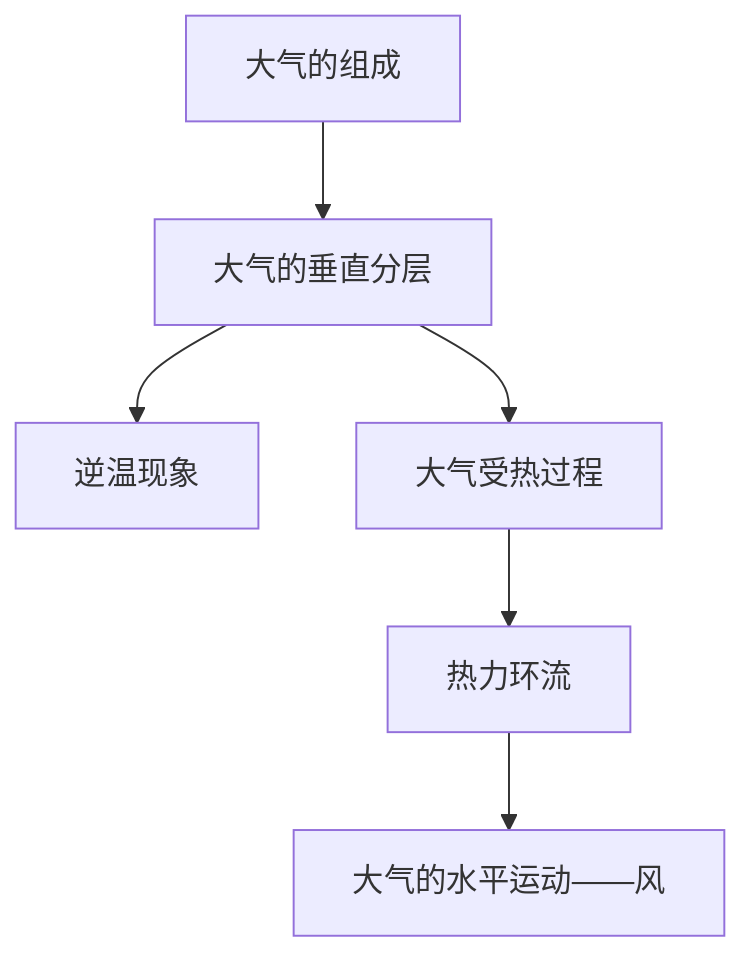

# 第二章 · 地球上的大气

> 本章学习大气的组成和垂直分层结构，理解大气受热过程和大气运动的基本原理。

## §2.1 大气的组成和垂直分层

- [[大气的组成]] - 干洁空气（N₂、O₂、CO₂、O₃等）、水汽、固体杂质的作用
- [[大气的垂直分层]] - 对流层、平流层、高层大气的特征（气温变化、大气运动、与人类关系）
- [[逆温现象]] - 逆温的概念、成因类型、对天气和大气污染的影响

## §2.2 大气受热过程和大气运动

- [[大气受热过程]] - 太阳辐射→地面增温→地面辐射→大气增温；大气对太阳辐射的削弱作用（吸收、反射、散射）；大气的保温作用（大气逆辐射）
- [[热力环流]] - 地面冷热不均→气压差→热力环流；海陆风、山谷风、城市热岛
- [[大气的水平运动——风]] - 水平气压梯度力、地转偏向力、摩擦力对风的影响；高空风与近地面风；风向与等压线的关系

---

## 章节状态

| 节 | 知识点数 | 平均掌握度 | 状态 |
|---|---|---|---|
| §2.1 | 3 | 0.3 | 🔄 学习中 |
| §2.2 | 3 | 0.3 | 🔄 学习中 |

**综合测试:** 未进行

---

## 知识结构图

