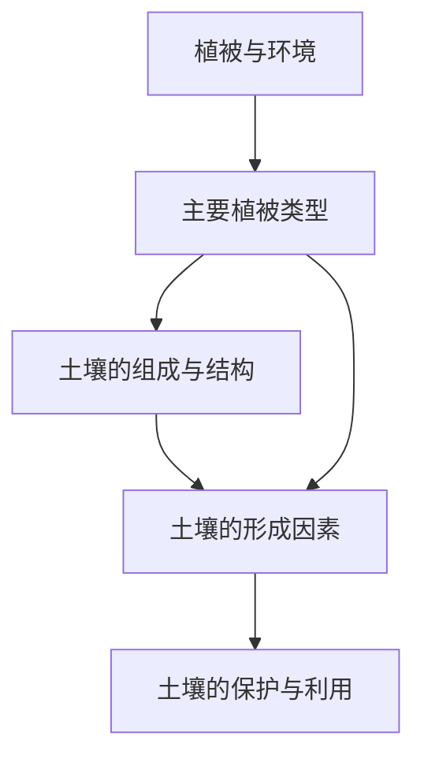

# 第五章 · 植被与土壤

> 本章了解植被与自然环境的关系，认识土壤的组成、形成和保护。

## §5.1 植被

- [[植被与环境]] - 植被概念、天然植被与人工植被、植被与环境的相互关系
- [[主要植被类型]] - 森林（热带雨林、常绿阔叶林、落叶阔叶林、亚寒带针叶林）、草原、荒漠的特征与分布

## §5.2 土壤

- [[土壤的组成与结构]] - 土壤的物质组成（矿物质、有机质、水分、空气）、土壤剖面（枯枝落叶层、腐殖质层、淋溶层、淀积层、母质层、基岩层）
- [[土壤的形成因素]] - 成土母质、气候、生物、地形、时间对土壤发育的影响
- [[土壤的保护与利用]] - 土壤退化（侵蚀、盐碱化、污染）及保护措施

---

## 章节状态

| 节 | 知识点数 | 平均掌握度 | 状态 |
|---|---|---|---|
| §5.1 | 2 | 0 | 已录入 |
| §5.2 | 3 | 0 | 已录入 |

**综合测试:** 未进行

---

## 知识结构图

