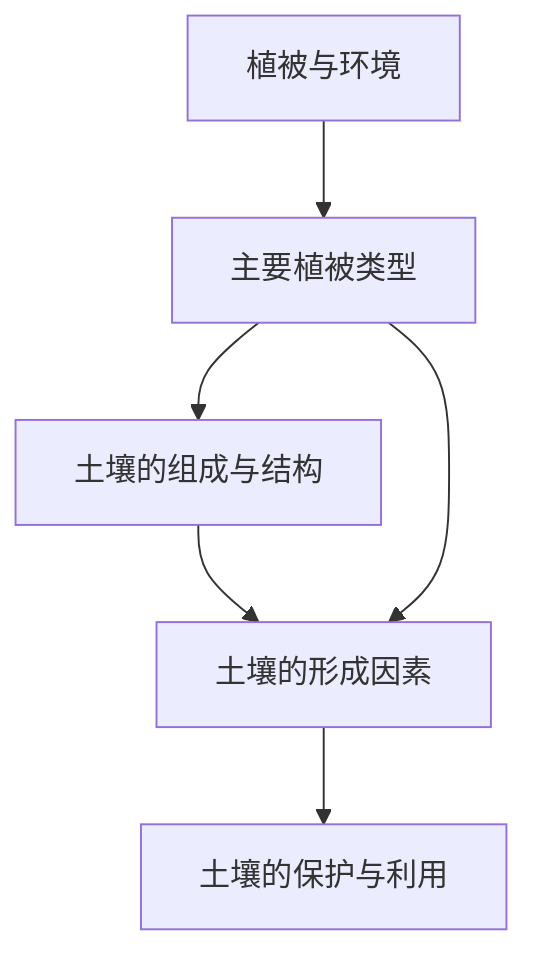

# 第五章 · 植被与土壤

> 本章了解植被与自然环境的关系，认识土壤的组成、形成和保护。

## §5.1 植被

- [[植被与环境]] - 植被概念、植被与环境的双向关系、四种森林类型（雨林→常绿阔叶→落叶阔叶→针叶）、草原、荒漠、分布规律

## §5.2 土壤

- [[土壤的形成与性质]] - 土壤四大组成（矿物质/有机质/水/空气）、三种质地（砂土/壤土/黏土）、土壤剖面、五大形成因素（生物最活跃）、功能与养护

---

## 章节状态

| 节 | 知识点数 | 平均掌握度 | 状态 |
|---|---|---|---|
| §5.1 | 1 | 0.3 | 🔄 学习中 |
| §5.2 | 1 | 0.3 | 🔄 学习中 |

**综合测试:** 未进行

---

## 知识结构图

