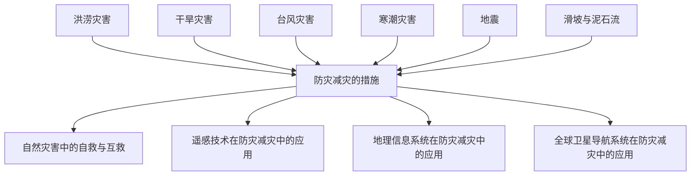

# 第六章 · 自然灾害

> 本章认识主要气象灾害和地质灾害的成因与防治，了解防灾减灾措施和地理信息技术的应用。

## §6.1 气象灾害

- [[气象灾害]] - 洪涝（暴雨→河水暴涨）、干旱（影响最广）、台风（有利有弊）、寒潮（24h降温≥8°C且最低≤4°C）

## §6.2 地质灾害

- [[地质灾害]] - 地震（震级vs烈度）、滑坡（整体下滑）、泥石流（陡+碎+水）、链式灾害关联性

---

## 章节状态

| 节 | 知识点数 | 平均掌握度 | 状态 |
|---|---|---|---|
| §6.1 | 1 | 0.3 | 🔄 学习中 |
| §6.2 | 1 | 0.3 | 🔄 学习中 |

**综合测试:** 未进行

---

## 知识结构图

