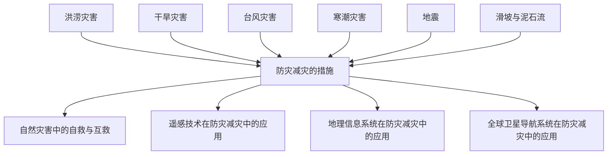

# 第六章 · 自然灾害

> 本章认识主要气象灾害和地质灾害的成因与防治，了解防灾减灾措施和地理信息技术的应用。

## §6.1 气象灾害

- [[洪涝灾害]] - 洪涝的成因、危害与防治措施
- [[干旱灾害]] - 干旱的成因、分布与影响
- [[台风灾害]] - 台风的形成、结构、移动路径与危害
- [[寒潮灾害]] - 寒潮的定义、成因、影响范围与危害

## §6.2 地质灾害

- [[地震]] - 地震的成因（构造地震）、震级与烈度、分布规律、危害与防御
- [[滑坡与泥石流]] - 滑坡、泥石流的成因、分布与防治

## §6.3 防灾减灾

- [[防灾减灾的措施]] - 灾前预防（监测预警、工程防御、避灾规划）、灾中应急（自救互救）、灾后恢复
- [[自然灾害中的自救与互救]] - 地震、洪水、台风等灾害中的正确避险行为

## §6.4 地理信息技术在防灾减灾中的应用

- [[遥感技术(RS)在防灾减灾中的应用]] - 遥感的工作原理、在灾害监测中的作用
- [[地理信息系统(GIS)在防灾减灾中的应用]] - GIS的功能与在灾害风险评估中的应用
- [[全球卫星导航系统(GNSS)在防灾减灾中的应用]] - GNSS定位原理与灾害救援中的应用

---

## 章节状态

| 节 | 知识点数 | 平均掌握度 | 状态 |
|---|---|---|---|
| §6.1 | 4 | 0 | 已录入 |
| §6.2 | 2 | 0 | 已录入 |
| §6.3 | 2 | 0 | 已录入 |
| §6.4 | 3 | 0 | 已录入 |

**综合测试:** 未进行

---

## 知识结构图

