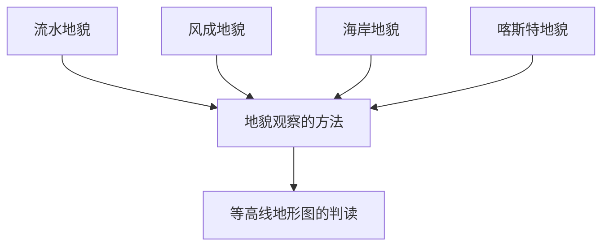

# 第四章 · 地貌

> 本章认识常见的地貌类型及其成因，学习野外地貌观察的方法。

## §4.1 常见地貌类型

- [[流水地貌]] - 流水侵蚀地貌（V形谷、瀑布）与流水堆积地貌（冲积扇、三角洲、河漫滩平原）
- [[风成地貌]] - 风蚀地貌（风蚀蘑菇、雅丹地貌）与风积地貌（沙丘及其移动方向判读）
- [[海岸地貌]] - 海蚀地貌（海蚀崖、海蚀平台）与海积地貌（沙滩）
- [[喀斯特地貌]] - 溶蚀地貌（溶沟、洼地、溶洞）与沉积地貌（石钟乳、石笋、石柱）；形成条件

## §4.2 地貌的观察

- [[地貌观察的方法]] - 观察顺序（宏观→微观）、观察内容（高度、坡度、形态）、地貌素描方法
- [[等高线地形图的判读]] - 等高线基本特征、常见地形（山峰、鞍部、山脊、山谷、陡崖）的判读

---

## 章节状态

| 节 | 知识点数 | 平均掌握度 | 状态 |
|---|---|---|---|
| §4.1 | 4 | 0 | 已录入 |
| §4.2 | 2 | 0 | 已录入 |

**综合测试:** 未进行

---

## 知识结构图

