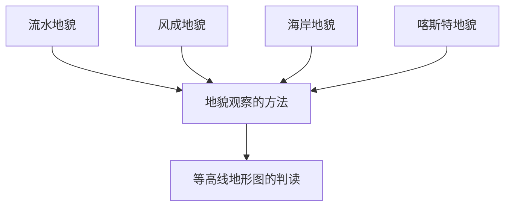

# 第四章 · 地貌

> 本章认识常见的地貌类型及其成因，学习野外地貌观察的方法。

## §4.1 常见地貌类型

- [[常见地貌类型]] - 喀斯特地貌（溶蚀/沉积）、河流地貌（V形谷、冲积扇、三角洲）、风沙地貌（风蚀蘑菇、沙丘判风向）、海岸地貌（海蚀崖、海滩）

## §4.2 地貌的观察

- [[地貌的观察]] - 观察顺序（宏观→微观）、观察内容（高度、坡度、坡向）、五大地形类型

---

## 章节状态

| 节 | 知识点数 | 平均掌握度 | 状态 |
|---|---|---|---|
| §4.1 | 1 | 0.3 | 🔄 学习中 |
| §4.2 | 1 | 0.3 | 🔄 学习中 |

**综合测试:** 未进行

---

## 知识结构图

