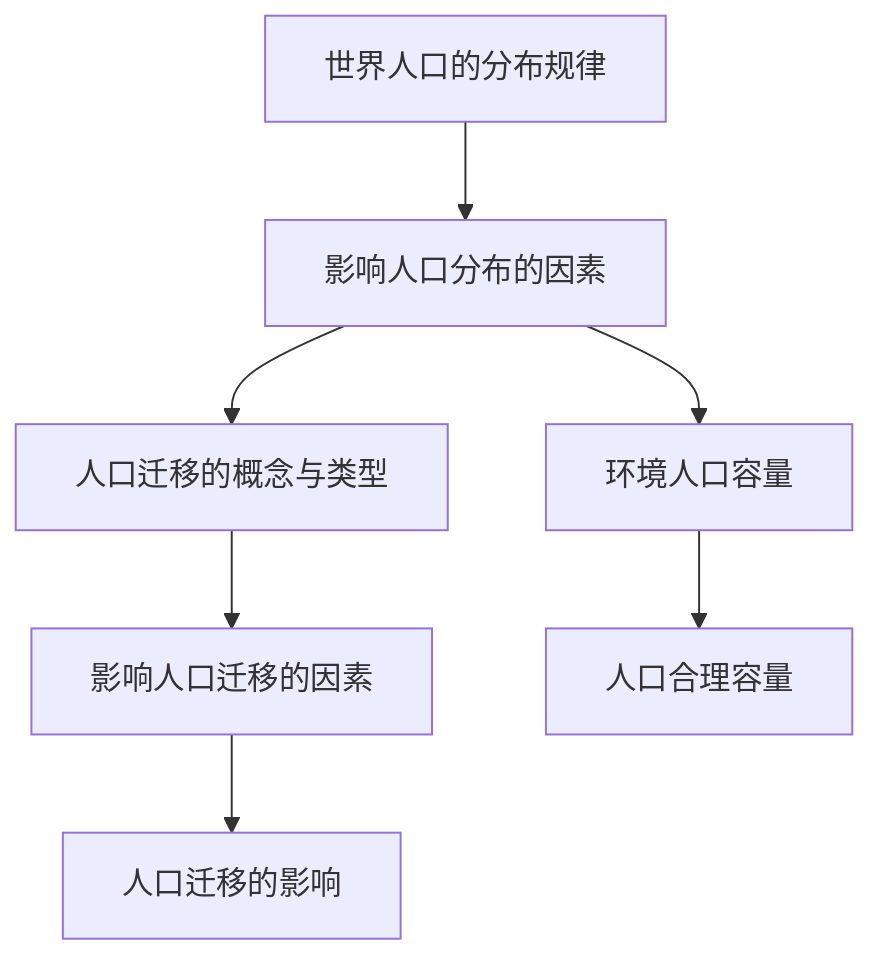

# 第一章 · 人口

> 本章学习人口分布的规律与影响因素，了解人口迁移的类型与影响，认识人口容量的概念。

## §1.1 人口分布

- [[世界人口的分布规律]] - 人口分布不均的表现、人口稠密区与稀疏区的分布
- [[影响人口分布的因素]] - 自然因素（气候、地形、水源）与人文因素（经济、交通、政策）

## §1.2 人口迁移

- [[人口迁移的概念与类型]] - 人口迁移的判断标准、国际迁移与国内迁移
- [[影响人口迁移的因素]] - 推拉因素分析、自然因素与社会经济因素
- [[人口迁移的影响]] - 对迁出地和迁入地的社会经济影响

## §1.3 人口容量

- [[环境人口容量]] - 环境人口容量的概念、影响因素（资源、科技、消费水平）、特征（临界性、相对性）
- [[人口合理容量]] - 人口合理容量的概念、与环境人口容量的区别

---

## 章节状态

| 节 | 知识点数 | 平均掌握度 | 状态 |
|---|---|---|---|
| §1.1 | 2 | 0 | 已录入 |
| §1.2 | 3 | 0 | 已录入 |
| §1.3 | 2 | 0 | 已录入 |

**综合测试:** 未进行

---

## 知识结构图

