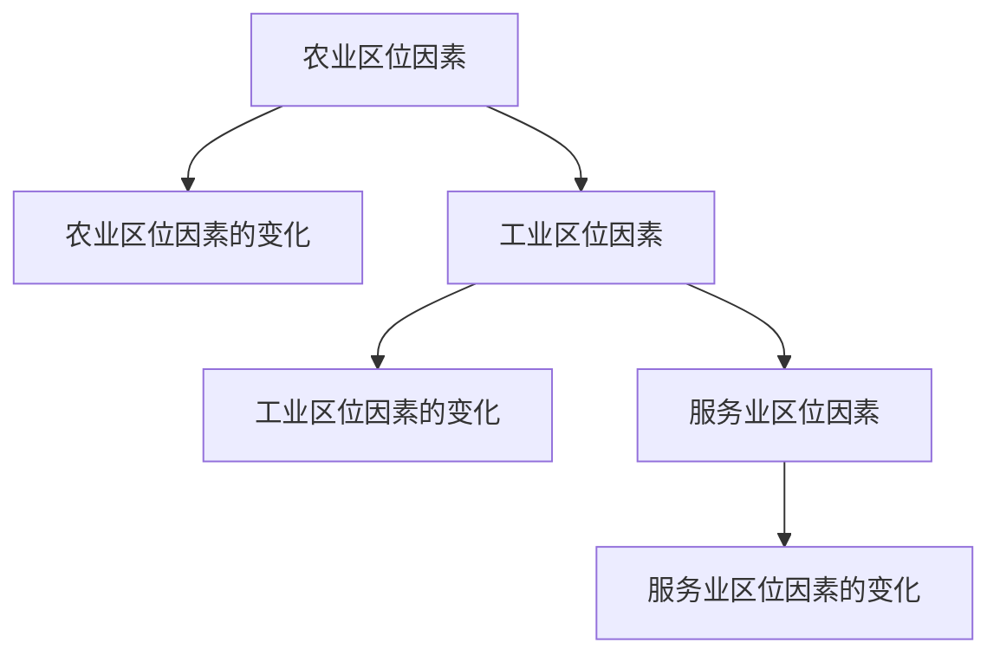

# 第三章 · 产业区位因素

> 本章分析农业、工业、服务业的区位因素及其变化，理解产业布局的一般规律。

## §3.1 农业区位因素及其变化

- [[农业区位因素]] - 自然因素（气候、地形、土壤、水源）与社会经济因素（市场、劳动力、交通、政策、科技）
- [[农业区位因素的变化]] - 科技进步、市场变化、交通改善对农业区位的影响；农业区位选择案例分析

## §3.2 工业区位因素及其变化

- [[工业区位因素]] - 原料、能源、劳动力、市场、交通、科技、政策等因素；主导因素分析
- [[工业区位因素的变化]] - 工业区位因素变化趋势（原料、交通影响减弱，科技、信息影响增强）

## §3.3 服务业区位因素及其变化

- [[服务业区位因素]] - 市场、交通、劳动力、科技等因素对服务业布局的影响
- [[服务业区位因素的变化]] - 互联网对服务业区位的影响、新型服务业的区位选择

---

## 章节状态

| 节 | 知识点数 | 平均掌握度 | 状态 |
|---|---|---|---|
| §3.1 | 2 | 0 | 已录入 |
| §3.2 | 2 | 0 | 已录入 |
| §3.3 | 2 | 0 | 已录入 |

**综合测试:** 未进行

---

## 知识结构图

