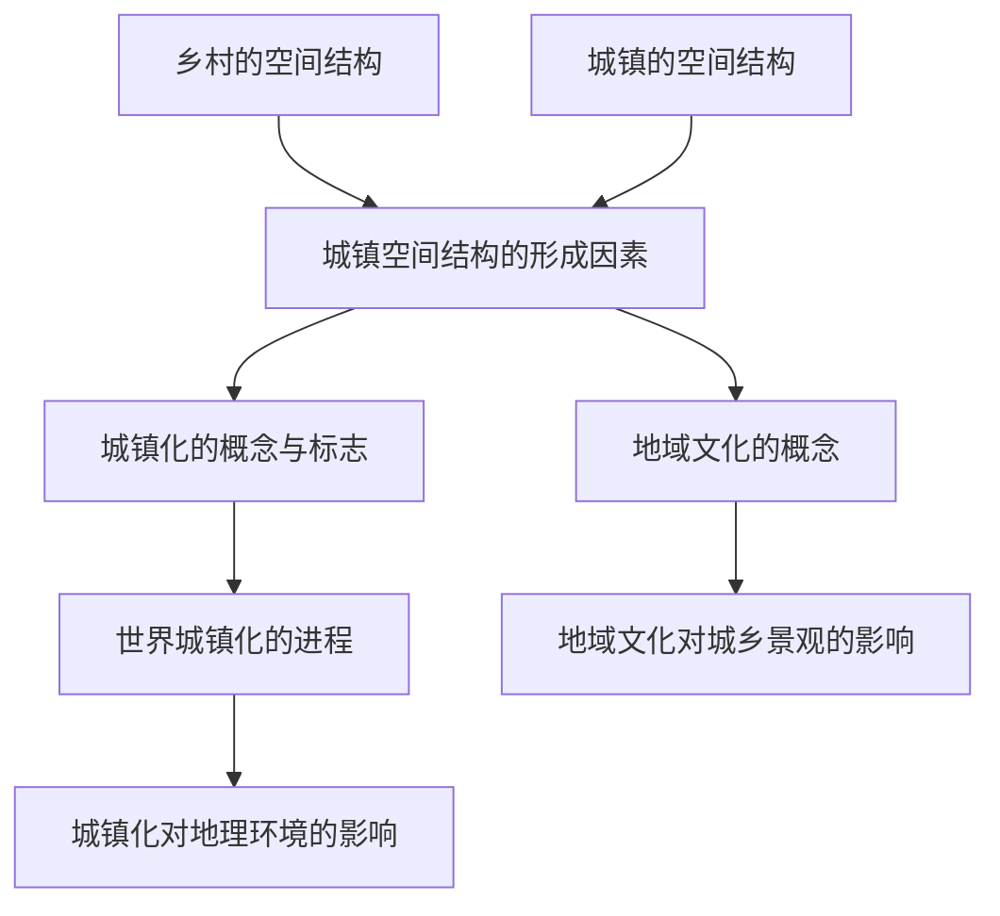

# 第二章 · 乡村和城镇

> 本章了解城镇的空间结构及其形成原因，认识城镇化进程及其影响，理解地域文化与城乡景观的关系。

## §2.1 乡村和城镇空间结构

- [[乡村的空间结构]] - 乡村聚落的形态与布局特征
- [[城镇的空间结构]] - 城镇功能区（商业区、住宅区、工业区）的分布特征与形成因素
- [[城镇空间结构的形成因素]] - 经济因素（地租理论）、社会因素、历史因素、行政因素

## §2.2 城镇化

- [[城镇化的概念与标志]] - 城镇化的定义、衡量指标（城镇化率）、主要表现
- [[世界城镇化的进程]] - 发达国家与发展中国家城镇化的特点与差异
- [[城镇化对地理环境的影响]] - 对自然环境和社会环境的影响、城镇化问题与解决措施

## §2.3 地域文化与城乡景观

- [[地域文化的概念]] - 地域文化的定义与形成因素
- [[地域文化对城乡景观的影响]] - 不同地域文化背景下城乡建筑、交通、土地利用等景观差异

---

## 章节状态

| 节 | 知识点数 | 平均掌握度 | 状态 |
|---|---|---|---|
| §2.1 | 3 | 0 | 已录入 |
| §2.2 | 3 | 0 | 已录入 |
| §2.3 | 2 | 0 | 已录入 |

**综合测试:** 未进行

---

## 知识结构图

