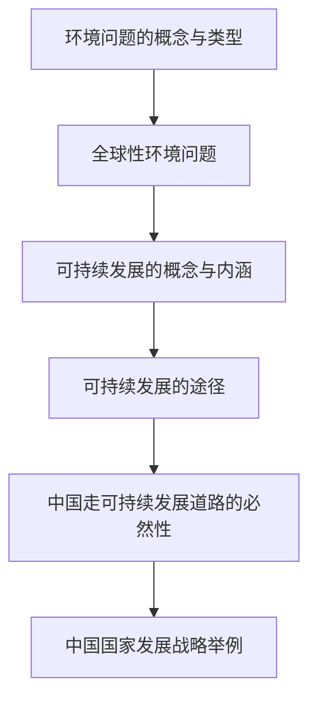

# 第五章 · 环境与发展

> 本章认识人类面临的主要环境问题，理解可持续发展的内涵与途径，了解中国国家发展战略。

## §5.1 人类面临的主要环境问题

- [[环境问题的概念与类型]] - 环境污染与生态破坏的区别、主要表现形式
- [[全球性环境问题]] - 全球气候变暖、臭氧层破坏、酸雨、生物多样性减少等问题的成因与影响

## §5.2 走向人地协调——可持续发展

- [[可持续发展的概念与内涵]] - 可持续发展的定义、三大原则（公平性、持续性、共同性）
- [[可持续发展的途径]] - 循环经济、清洁生产、生态农业等可持续发展实践

## §5.3 中国国家发展战略举例

- [[中国走可持续发展道路的必然性]] - 中国的人口、资源、环境现状与可持续发展战略
- [[中国国家发展战略举例]] - 生态文明建设、碳达峰碳中和、乡村振兴等战略

---

## 章节状态

| 节 | 知识点数 | 平均掌握度 | 状态 |
|---|---|---|---|
| §5.1 | 2 | 0 | 已录入 |
| §5.2 | 2 | 0 | 已录入 |
| §5.3 | 2 | 0 | 已录入 |

**综合测试:** 未进行

---

## 知识结构图

