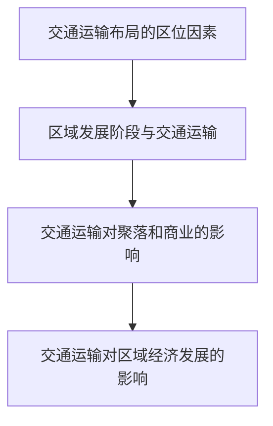

# 第四章 · 交通运输布局与区域发展

> 本章分析区域发展与交通运输的相互影响，理解交通运输布局的区位因素。

## §4.1 区域发展对交通运输布局的影响

- [[交通运输布局的区位因素]] - 自然因素（地形、气候、水文）与社会经济因素（经济发展、人口分布、城镇布局）对交通线和站点布局的影响
- [[区域发展阶段与交通运输]] - 不同发展阶段区域的交通运输需求与布局变化

## §4.2 交通运输布局对区域发展的影响

- [[交通运输对聚落和商业的影响]] - 交通运输方式变化对聚落空间形态、商业网点布局的影响
- [[交通运输对区域经济发展的影响]] - 交通枢纽的形成、交通优势对产业集聚的促进作用

---

## 章节状态

| 节 | 知识点数 | 平均掌握度 | 状态 |
|---|---|---|---|
| §4.1 | 2 | 0 | 已录入 |
| §4.2 | 2 | 0 | 已录入 |

**综合测试:** 未进行

---

## 知识结构图

