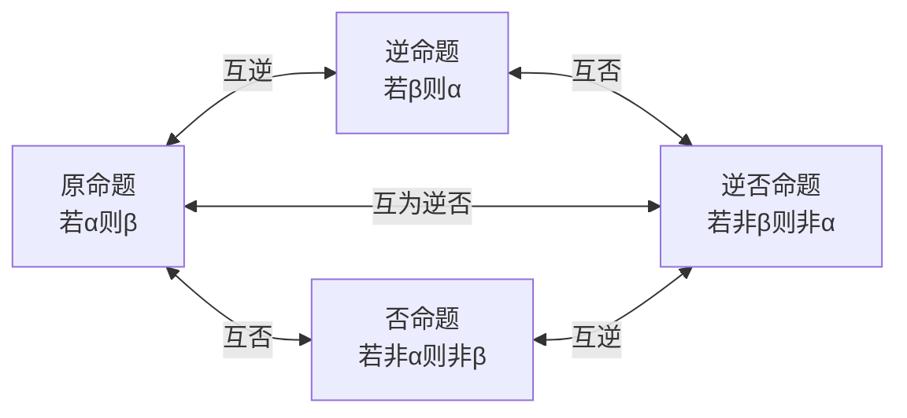

# 命题的形式与逆否命题

*The Forms of Propositions and Equivalent Relationship*

## 1. 命题与推出关系

### 命题的定义

> [!definition] 命题
> 可以判断真假的语句叫做**命题**（proposition）。命题通常用陈述句表述。
> - 正确的命题叫做**真命题**
> - 错误的命题叫做**假命题**

**不是命题的语句：**
- 疑问句（如"你是高一学生吗？"）
- 祈使句（如"上课请不要讲话"）
- 感叹句
- 无法判断真假的模糊语句

### 例1　判断命题

下列语句哪些不是命题？哪些是命题？如果是命题，是真命题还是假命题？

(1) 个位数是 5 的自然数能被 5 整除；
(2) 凡直角三角形都相似；
(3) 上课请不要讲话；
(4) 互为补角的两个角不相等；
(5) 如果两个三角形的三条边对应相等，那么这两个三角形全等；
(6) 你是高一学生吗？

> [!hint]- 解
> - (3)、(6) 不是命题。(3) 是祈使句，(6) 是疑问句。
> - (1)、(2)、(4)、(5) 是命题：
>   - **(1) 真命题**：个位数是 5 的自然数可写成 $10k + 5 = 5(2k+1)$ 的形式（$k \in \mathbb{N}$），所以能被 5 整除。
>   - **(2) 假命题**：取三个角分别为 $90°, 45°, 45°$ 和 $90°, 60°, 30°$ 的两个直角三角形，它们不相似。
>   - **(4) 假命题**：取两个角都为 $90°$，它们互为补角但相等。
>   - **(5) 真命题**：这是三角形全等的 SSS 判定定理。

> [!important] 举反例
> 要确定一个命题是假命题，只要举出一个满足命题条件但不满足命题结论的例子就可以了。这在数学中称为**举反例**。

### 推出关系

命题由**条件**与**结论**两部分组成。

> [!definition] 推出
> 如果命题 $\alpha$ 成立可以推出命题 $\beta$ 也成立，那么就说由 $\alpha$ 可以推出 $\beta$，记作 $\alpha \Rightarrow \beta$，读作"$\alpha$ 推出 $\beta$"。
>
> 换言之，$\alpha \Rightarrow \beta$ 表示以 $\alpha$ 为条件、$\beta$ 为结论的命题是**真命题**。

如果 $\alpha$ 不能推出 $\beta$，记作 $\alpha \not\Rightarrow \beta$，即以 $\alpha$ 为条件、$\beta$ 为结论的命题是假命题。

**例：** 设 $\alpha$: $x > y$，$\beta$: $x + 2y > x + y$。
- 取 $x = 1, y = 0$，则 $\alpha$ 成立但 $\beta$ 不成立，所以 $\alpha \not\Rightarrow \beta$。

### 等价关系

> [!definition] 等价
> 如果 $\alpha \Rightarrow \beta$，并且 $\beta \Rightarrow \alpha$，那么记作 $\alpha \Leftrightarrow \beta$，叫做 $\alpha$ 与 $\beta$ **等价**。

### 推出关系的传递性

$\alpha \Rightarrow \beta$，$\beta \Rightarrow \gamma$，那么 $\alpha \Rightarrow \gamma$。

这是证明命题正确的基本方法：找出一系列正确命题 $\alpha \Rightarrow \alpha_1, \alpha_1 \Rightarrow \alpha_2, \ldots, \alpha_n \Rightarrow \beta$，利用传递性得 $\alpha \Rightarrow \beta$。

### 练习 1.4(1)

1. 判断下列命题的真假：
   - (1) 素数是奇数；
   - (2) 不含任何元素的集合是空集；
   - (3) $\{1\}$ 是 $\{0, 1, 2\}$ 的真子集；
   - (4) $0$ 是 $\{0, 1, 2\}$ 的真子集；
   - (5) $A, B$ 为两集合，如果 $A \cap B = A$，那么 $A \subseteq B$；
   - (6) 如果 $A$ 是 $B$ 的子集，那么 $B$ 不是 $A$ 的子集。

> [!hint]- 答案
> (1) 假（2 是素数但不是奇数）；(2) 真；(3) 真；(4) 假（$0 \in \{0,1,2\}$，不是子集关系）；(5) 真；(6) 假（$A = B$ 时互为子集）

2. 用符号 $\Rightarrow$、$\Leftarrow$、$\Leftrightarrow$ 表示下列事件的推出关系：
   - (1) $\alpha$: $\triangle ABC$ 是等边三角形，$\beta$: $\triangle ABC$ 是轴对称图形。$\alpha \Rightarrow \beta$
   - (2) $\alpha$: 一次函数 $y = kx + b$ 的图像经过第一、二、三象限，$\beta$: $k > 0, b > 0$。$\alpha \Leftrightarrow \beta$
   - (3) $\alpha$: 实数 $x$ 适合 $x^2 = 1$，$\beta$: $x = 1$。$\alpha \Leftarrow \beta$

---

## 2. 四种命题形式

一个数学命题用条件 $\alpha$、结论 $\beta$ 表示就是"如果 $\alpha$，那么 $\beta$"。

> [!important] 四种命题

| 命题形式 | 表述 | 记号 |
|---|---|---|
| **原命题** | 如果 $\alpha$，那么 $\beta$ | $\alpha \Rightarrow \beta$ |
| **逆命题** (inverse) | 如果 $\beta$，那么 $\alpha$ | $\beta \Rightarrow \alpha$ |
| **否命题** (negative) | 如果 $\overline{\alpha}$，那么 $\overline{\beta}$ | $\overline{\alpha} \Rightarrow \overline{\beta}$ |
| **逆否命题** (contrapositive) | 如果 $\overline{\beta}$，那么 $\overline{\alpha}$ | $\overline{\beta} \Rightarrow \overline{\alpha}$ |

其中 $\overline{\alpha}$ 表示 $\alpha$ 的否定。

### 四种命题的关系图

### 例2　写逆命题和否命题

命题 A："如果两个三角形全等，那么它们的面积相等"
命题 B："如果一个三角形两边相等，那么这两边所对的角也相等"

> [!hint]- 解
> **命题 A：**
> - 逆命题："如果两个三角形的面积相等，那么这两个三角形全等"——**假命题**
> - 否命题："如果两个三角形不全等，那么它们的面积不相等"——**假命题**
> - 逆否命题："如果两个三角形的面积不相等，那么这两个三角形不全等"——**真命题**
>
> **命题 B：**
> - 逆命题："如果一个三角形的两个角相等，那么它们所对的边也相等"——**真命题**
> - 否命题："如果一个三角形的两边不相等，那么这两边所对的角也不相等"——**真命题**
> - 逆否命题："如果一个三角形的两个角不相等，那么它们所对的边也不相等"——**真命题**（等腰三角形判定定理的逆否形式）

### 练习 1.4(2)

1. 写出下列命题的否定形式：
   - (1) 2 是正数 → 否定：2 不是正数
   - (2) $a \in A$ → 否定：$a \notin A$
   - (3) 我们班至少有一个区三好学生 → 否定：我们班没有区三好学生

2. 写出命题"如果 $a = 0$，那么 $ab = 0$"的逆命题、否命题和逆否命题，并判断其真假。

3. 写出命题"如果两个角是对顶角，那么这两个角相等"的逆命题、否命题和逆否命题，并判断其真假。

---

## 3. 等价命题

> [!definition] 等价命题
> 如果 $A \Rightarrow B$，且 $B \Rightarrow A$，那么 $A$、$B$ 叫做**等价命题**（equivalent proposition）。

> [!important] 核心定理
> **原命题与它的逆否命题是等价命题**（同真同假）。
>
> 即：$(\alpha \Rightarrow \beta) \Leftrightarrow (\overline{\beta} \Rightarrow \overline{\alpha})$

**应用：** 当我们证明某个命题有困难时，可以尝试证明它的逆否命题来代替。

### 例3　利用逆否命题证明

已知 $BD$、$CE$ 分别是 $\triangle ABC$ 的 $\angle B$、$\angle C$ 的角平分线，$BD \neq CE$。
求证：$AB \neq AC$。

> [!hint]- 证明
> 题中条件与结论都有不等关系，直接证明比较困难。考虑证明逆否命题：
>
> **逆否命题：** "如果 $AB = AC$，那么 $BD = CE$"
>
> 证明：若 $AB = AC$，则 $\triangle ABC$ 是等腰三角形，所以 $\angle B = \angle C$。
> 又 $BD$、$CE$ 分别是 $\angle B$、$\angle C$ 的角平分线，所以 $\angle ABD = \angle ACE = \frac{1}{2}\angle B = \frac{1}{2}\angle C$。
> 在 $\triangle ABD$ 和 $\triangle ACE$ 中：$\angle A$ 公共，$AB = AC$，$\angle ABD = \angle ACE$，
> 所以 $\triangle ABD \cong \triangle ACE$（ASA），故 $BD = CE$。
>
> 因为逆否命题为真，所以原命题为真：$BD \neq CE \Rightarrow AB \neq AC$。

---

## 易错点

> [!warning] 常见错误
> - **混淆"否命题"和"命题的否定"**：
>   - 否命题：条件和结论都否定（"若非α则非β"）
>   - 命题的否定：只否定结论（"若α则非β"）
>   - 例："若 $x > 0$，则 $x^2 > 0$"的否命题是"若 $x \leq 0$，则 $x^2 \leq 0$"；命题的否定是"存在 $x > 0$，使 $x^2 \leq 0$"
> - **逆命题 ≠ 否命题**：它们只在特殊情况下同真同假
> - **忘记核心等价关系**：原命题 ⟺ 逆否命题（总是同真同假），但原命题与逆命题、否命题没有必然的真假关系
> - **否定写错**：
>   - "至少一个" 的否定是 "一个也没有"（不是"至多一个"）
>   - "$\geq$" 的否定是 "$<$"（不是 "$\leq$"）
>   - "都是" 的否定是 "不都是"（不是"都不是"）

---

## 关联知识点

- 前置：[[集合的概念]] — 命题举例中大量使用集合语言
- 后续：[[充分条件与必要条件]] — 推出关系是充分/必要条件的基础
- 后续：[[子集与推出关系]] — $A \subseteq B$ 与 $\alpha \Rightarrow \beta$ 的对应
- 应用：[[充要条件]] — 等价命题就是充要条件关系
