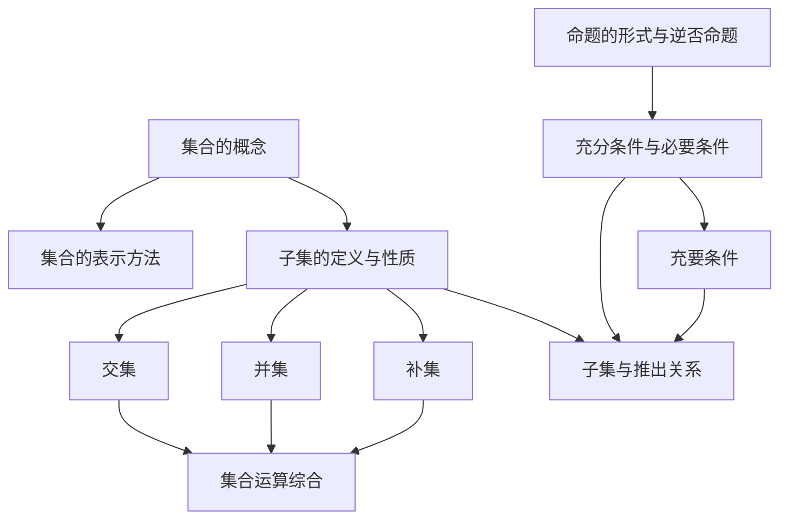

# 第一章 · 集合和命题

> 本章建立集合语言和逻辑基础，是高中数学的起点。

## 一、集合

### §1.1 集合及其表示法
- [[集合的概念]] — 集合定义、元素三性质（确定性/互异性/无序性）、常用记号
- [[集合的表示方法]] — 列举法、描述法、选择技巧

### §1.2 集合之间的关系
- [[子集的定义与性质]] — 子集 $A \subseteq B$、真子集 $A \subsetneq B$、集合相等、文氏图

### §1.3 集合的运算
- [[交集]] — $A \cap B$ 定义、性质、文氏图表示
- [[并集]] — $A \cup B$ 定义、性质、文氏图表示
- [[补集]] — 全集 $U$、$\complement_U A$ 定义、德摩根定律

## 二、四种命题的形式

### §1.4 命题的形式及等价关系
- [[命题的形式与逆否命题]] — 命题定义、原命题/逆命题/否命题/逆否命题、等价关系

## 三、充分条件与必要条件

### §1.5 充分条件，必要条件
- [[充分条件与必要条件]] — 充分条件、必要条件定义与判定
- [[充要条件]] — 充要条件定义、证明方法

### §1.6 子集与推出关系
- [[子集与推出关系]] — $A \subseteq B \iff p \Rightarrow q$，集合语言与逻辑语言的统一

---

## 章节状态

| 节 | 知识点数 | 平均掌握度 | 状态 |
|---|---|---|---|
| §1.1 | 2 | 0.30 | 🔄 学习中 |
| §1.2 | 1 | 0.00 | 🆕 未开始 |
| §1.3 | 3 | 0.00 | 🆕 未开始 |
| §1.4 | 1 | 0.00 | 🆕 未开始 |
| §1.5 | 2 | 0.00 | 🆕 未开始 |
| §1.6 | 1 | 0.00 | 🆕 未开始 |

**综合测试：** 未进行

---

## 知识结构图

