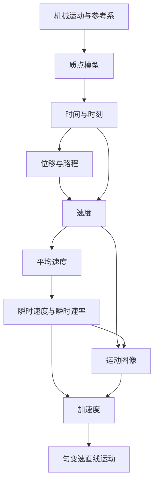

# 第一章 · 物体运动的描述

> 本章建立描述运动的基本概念——质点、参考系、位移、速度、加速度，为后续运动规律的研究奠定基础。

## §1.1 运动与质点模型

- [[机械运动与参考系]] — 机械运动定义、参考系概念、运动的相对性
- [[质点模型]] — 质点定义、使用条件、理想模型方法
- [[时间与时刻]] — 时刻（瞬间）与时间（间隔）的区别、时间轴表示
- [[位移与路程]] — 位移（矢量）与路程（标量）的区别、坐标表示位置和位移

## §1.2 怎样描述运动的快慢

- [[速度]] — 速度定义 $v = s/t$、单位 m/s、矢量性、匀速直线运动
- [[平均速度]] — 平均速度 $\bar{v} = s/t$、仅反映某段时间内的平均快慢

## §1.3 怎样描述运动的快慢（续）

- [[瞬时速度与瞬时速率]] — 瞬时速度定义、速率、打点计时器测量方法、极限法
- [[运动图像]] — $s\text{-}t$ 图像与 $v\text{-}t$ 图像、图像斜率的物理意义

## §1.4 怎样描述速度变化的快慢

- [[加速度]] — 加速度定义 $a = \Delta v / \Delta t$、单位 m/s²、方向判断、$v\text{-}t$ 图像斜率
- [[匀变速直线运动]] — 匀变速直线运动定义、特点、实验验证方法

---

## 章节状态

| 节 | 知识点数 | 平均掌握度 | 状态 |
|---|---|---|---|
| §1.1 | 4 | 0.30 | 🔄 学习中 |
| §1.2 | 2 | 0.30 | 🔄 学习中 |
| §1.3 | 2 | 0.30 | 🔄 学习中 |
| §1.4 | 2 | 0.30 | 🔄 学习中 |

**综合测试：** 未进行

---

## 知识结构图

