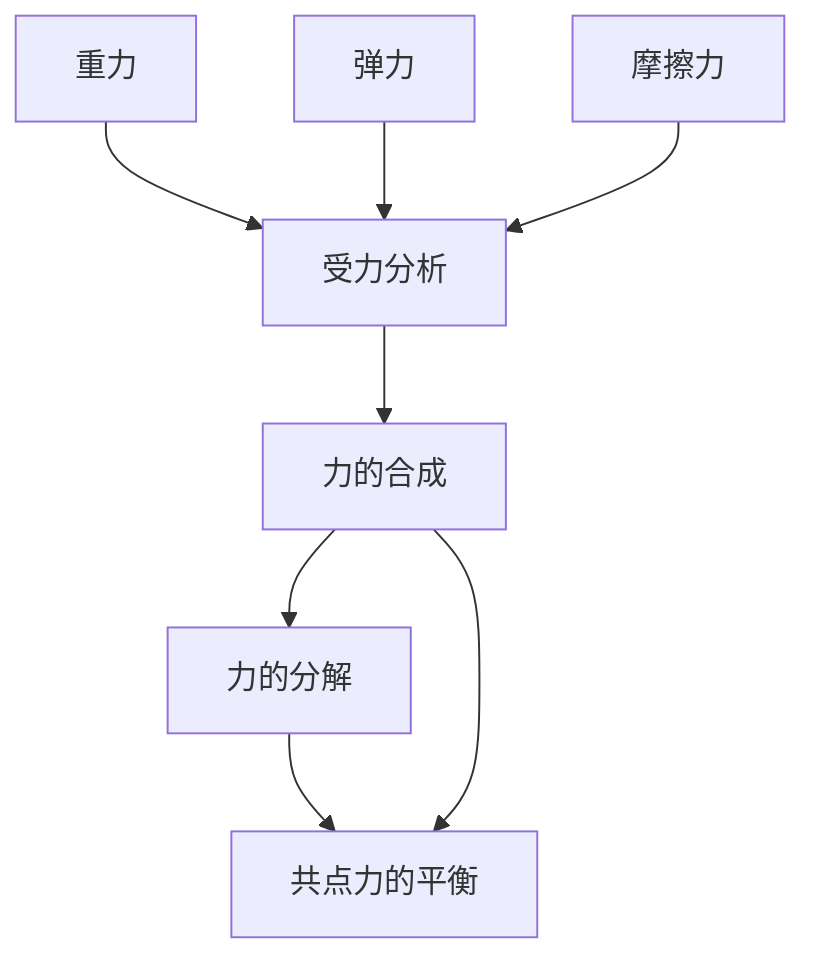

# 第三章 力与相互作用

## 章节概述

本章认识三种常见力（重力、弹力、摩擦力），学习受力分析方法，掌握力的合成与分解（平行四边形定则），并应用于共点力平衡问题。

---

## 知识点索引

### §3.1 重力
- [[重力]]

### §3.2 弹力
- [[弹力]]

### §3.3 摩擦力
- [[摩擦力]]

### §3.4 分析物体的受力情况
- [[受力分析]]

### §3.5 怎样求合力
- [[力的合成]]

### §3.6 怎样分解力
- [[力的分解]]

### §3.7 共点力的平衡及其应用
- [[共点力的平衡]]

---

## 章节状态

| 节 | 知识点数 | 平均掌握度 | 状态 |
|---|---|---|---|
| §3.1 | 1 | 0.00 | 🆕 未开始 |
| §3.2 | 1 | 0.00 | 🆕 未开始 |
| §3.3 | 1 | 0.00 | 🆕 未开始 |
| §3.4 | 1 | 0.00 | 🆕 未开始 |
| §3.5 | 1 | 0.00 | 🆕 未开始 |
| §3.6 | 1 | 0.00 | 🆕 未开始 |
| §3.7 | 1 | 0.00 | 🆕 未开始 |

**综合测试：** 未进行

---

## 知识结构图

---

## 核心公式汇总

| 公式 | 表达式 | 适用条件 |
|---|---|---|
| 重力 | $G = mg$ | 任何有质量的物体 |
| 胡克定律 | $F = kx$ | 弹性限度内 |
| 滑动摩擦力 | $f = \mu N$ | 有相对滑动时 |
| 合力范围 | $|F_1 - F_2| \leq F \leq F_1 + F_2$ | 两个共点力 |
| 斜面分解 | $F_\parallel = mg\sin\theta$，$F_\perp = mg\cos\theta$ | 斜面上的重力 |
| 平衡条件 | $F_{\text{合}} = 0$ | 静止或匀速 |
