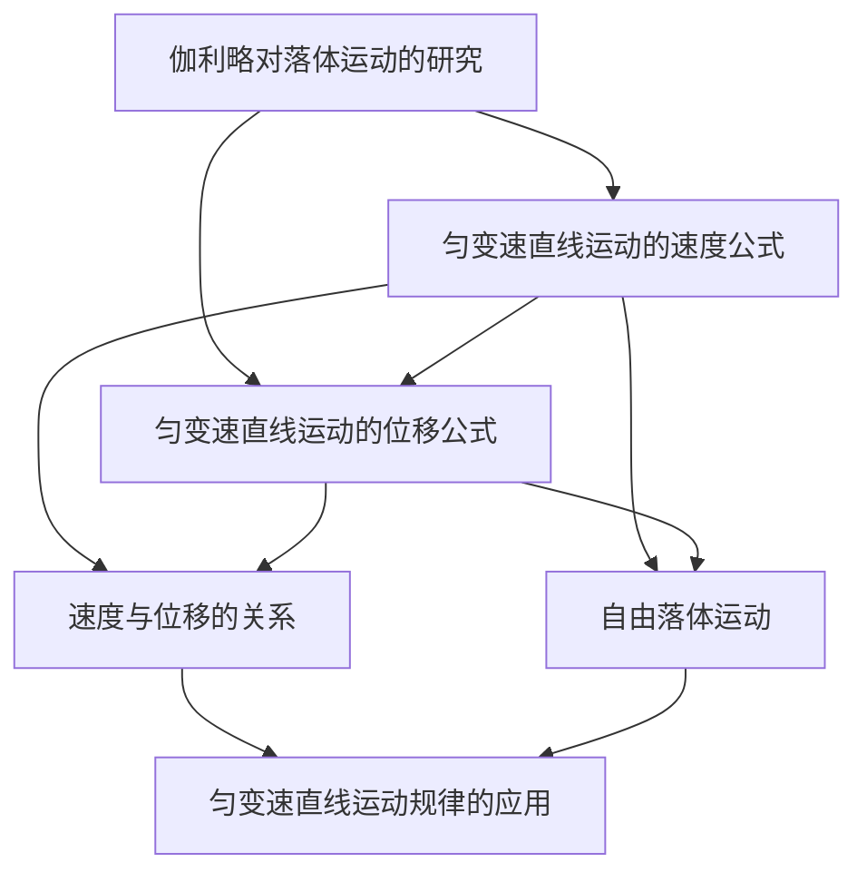

# 第二章 匀变速直线运动的规律

## 章节概述

本章从伽利略对落体运动的研究出发，系统建立匀变速直线运动的三个基本公式，并将其应用于自由落体和实际问题。

---

## 知识点索引

### §2.1 伽利略对落体运动的研究
- [[伽利略对落体运动的研究]]

### §2.2 匀变速直线运动的规律
- [[匀变速直线运动的速度公式]]
- [[匀变速直线运动的位移公式]]
- [[速度与位移的关系]]

### §2.3 自由落体运动的规律
- [[自由落体运动]]

### §2.4 匀变速直线运动规律的应用
- [[匀变速直线运动规律的应用]]

---

## 章节状态

| 节 | 知识点数 | 平均掌握度 | 状态 |
|---|---|---|---|
| §2.1 | 1 | 0.30 | 🔄 学习中 |
| §2.2 | 3 | 0.30 | 🔄 学习中 |
| §2.3 | 1 | 0.30 | 🔄 学习中 |
| §2.4 | 1 | 0.30 | 🔄 学习中 |

**综合测试：** 未进行

---

## 知识结构图

---

## 核心公式汇总

| 公式 | 表达式 | 不含的量 |
|---|---|---|
| 速度公式 | $v_t = v_0 + at$ | $s$ |
| 位移公式 | $s = v_0 t + \frac{1}{2}at^2$ | $v_t$ |
| $v^2$ 公式 | $v_t^2 - v_0^2 = 2as$ | $t$ |
| 平均速度 | $\bar{v} = \frac{v_0 + v_t}{2}$ | $a$ |
| 自由落体 | $v_t = gt$，$h = \frac{1}{2}gt^2$ | — |
